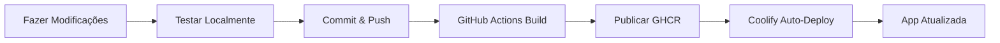

# Guia de Customização do Chatwoot

Este guia explica como customizar o frontend do Chatwoot (remover logo, adicionar toggle na sidebar) e fazer o deploy da versão customizada no Coolify.

## 📋 Índice

1. [Estrutura do Projeto](#estrutura-do-projeto)
2. [Customizações Comuns](#customizações-comuns)
3. [Workflow de Desenvolvimento](#workflow-de-desenvolvimento)
4. [Build e Deploy](#build-e-deploy)
5. [Deploy no Coolify](#deploy-no-coolify)

---

## 🏗️ Estrutura do Projeto

```
chatwootfz/
├── app/javascript/dashboard/          # Frontend Vue.js
│   ├── App.vue                        # Componente raiz
│   ├── components/                    # Componentes Vue
│   │   └── layout/
│   │       └── Sidebar/               # Componentes da Sidebar
│   │           ├── PrimarySidebar.vue
│   │           └── SecondarySidebar.vue
│   ├── assets/                        # Assets estáticos
│   │   └── images/                    # Imagens e logos
│   └── routes/                        # Rotas Vue Router
├── Dockerfile.production              # Dockerfile para produção
├── docker-compose.production.local.yaml  # Teste local
└── .github/workflows/docker-build.yml # CI/CD GitHub Actions
```

---

## 🎨 Customizações Comuns

### 1. Remover/Alterar Logo

**Localização:** `app/javascript/dashboard/components/layout/Sidebar/PrimarySidebar.vue`

```bash
# Encontrar o componente da logo
grep -r "logo" app/javascript/dashboard/components/layout/Sidebar/
```

**Exemplo de modificação:**

```vue
<!-- Antes -->


<!-- Depois (remover) -->
<!-- Logo removido -->

<!-- OU substituir por sua logo -->

```

### 2. Adicionar Toggle na Sidebar

**Localização:** `app/javascript/dashboard/components/layout/Sidebar/PrimarySidebar.vue`

**Passo 1:** Adicionar estado reativo

```vue
<script setup>
import { ref } from 'vue'

const sidebarCollapsed = ref(false)

const toggleSidebar = () => {
  sidebarCollapsed.value = !sidebarCollapsed.value
}
</script>
```

**Passo 2:** Adicionar botão de toggle

```vue
<template>
  <aside :class="['sidebar', { 'sidebar--collapsed': sidebarCollapsed }]">
    <!-- Botão de toggle -->
    <button
      @click="toggleSidebar"
      class="absolute top-4 right-4 p-2 rounded hover:bg-slate-100"
    >
      <fluent-icon
        :icon="sidebarCollapsed ? 'chevron-right' : 'chevron-left'"
        size="16"
      />
    </button>

    <!-- Resto do conteúdo da sidebar -->
  </aside>
</template>
```

**Passo 3:** Adicionar classes Tailwind para animação

```vue
<style>
.sidebar {
  @apply transition-all duration-300 w-64;
}

.sidebar--collapsed {
  @apply w-16;
}
</style>
```

### 3. Customizar Cores e Tema

**Localização:** `tailwind.config.js`

```javascript
module.exports = {
  theme: {
    extend: {
      colors: {
        // Adicione suas cores customizadas
        'brand-primary': '#your-color',
        'brand-secondary': '#your-color',
      }
    }
  }
}
```

### 4. Modificar Textos e Traduções

**Localização:** `app/javascript/dashboard/i18n/locale/en/`

```json
{
  "SIDEBAR": {
    "DASHBOARD": "Dashboard Customizado",
    // ... outras traduções
  }
}
```

---

## 🔧 Workflow de Desenvolvimento

### Passo 1: Configurar ambiente local

```bash
# Clonar o fork
git clone https://github.com/admfizgo-spec/chatwootfz.git
cd chatwootfz

# Copiar arquivo de ambiente
cp .env.example .env

# Subir ambiente de desenvolvimento
docker compose up
```

Acesse: http://localhost:3000

### Passo 2: Fazer modificações

1. Edite os arquivos Vue em `app/javascript/dashboard/`
2. O Vite fará hot-reload automático
3. Teste as mudanças no navegador

### Passo 3: Testar build de produção localmente

```bash
# Build da imagem de produção
docker compose -f docker-compose.production.local.yaml build

# Subir ambiente de produção local
docker compose -f docker-compose.production.local.yaml up

# Primeira execução: criar banco de dados
docker compose -f docker-compose.production.local.yaml exec chatwoot-web bundle exec rails db:create db:schema:load db:seed

# Acessar: http://localhost:3000
```

**Credenciais padrão após seed:**
- Email: `admin@example.com`
- Password: `Password1!`

### Passo 4: Commit e Push

```bash
git add .
git commit -m "feat: adicionar toggle na sidebar e remover logo"
git push origin main
```

---

## 🚀 Build e Deploy Automático

### GitHub Actions (Configurado)

Toda vez que você fizer push para `main`:

1. GitHub Actions vai automaticamente:
   - Fazer build da imagem Docker
   - Publicar no GitHub Container Registry (GHCR)
   - Tag: `ghcr.io/admfizgo-spec/chatwootfz:latest`

2. Acompanhe o build em:
   - https://github.com/admfizgo-spec/chatwootfz/actions

### Habilitar GHCR no seu repositório

1. Vá em **Settings** > **Actions** > **General**
2. Em "Workflow permissions", selecione:
   - ✅ Read and write permissions
3. Salve as mudanças

### Tornar imagem pública (opcional)

1. Vá em seu perfil GitHub > **Packages**
2. Selecione `chatwootfz`
3. **Package settings** > **Change visibility** > Public

---

## ☁️ Deploy no Coolify

### Método 1: Usando Docker Image (Recomendado)

#### 1. Criar novo Resource no Coolify

1. Acesse seu Coolify
2. **+ Add Resource** > **Docker Image**
3. Preencha:
   - **Name:** `chatwoot-custom`
   - **Image:** `ghcr.io/admfizgo-spec/chatwootfz:latest`
   - **Port:** `3000`

#### 2. Configurar Variáveis de Ambiente

Adicione as seguintes variáveis:

```bash
# Rails
RAILS_ENV=production
SECRET_KEY_BASE=seu_secret_key_base_aqui

# Database (configure seu PostgreSQL no Coolify)
POSTGRES_HOST=seu_postgres_host
POSTGRES_PORT=5432
POSTGRES_DATABASE=chatwoot_production
POSTGRES_USERNAME=chatwoot
POSTGRES_PASSWORD=sua_senha_segura

# Redis (configure seu Redis no Coolify)
REDIS_URL=redis://:senha@seu_redis_host:6379

# Chatwoot
INSTALLATION_NAME=Minha Empresa
FRONTEND_URL=https://seu-dominio.com
FORCE_SSL=true

# Mailer
MAILER_SENDER_EMAIL=noreply@seu-dominio.com
SMTP_DOMAIN=seu-dominio.com
SMTP_ADDRESS=seu_smtp
SMTP_PORT=587
SMTP_USERNAME=seu_usuario
SMTP_PASSWORD=sua_senha
SMTP_AUTHENTICATION=plain
SMTP_ENABLE_STARTTLS_AUTO=true

# Storage (S3 recomendado para produção)
ACTIVE_STORAGE_SERVICE=amazon
AWS_ACCESS_KEY_ID=sua_key
AWS_SECRET_ACCESS_KEY=sua_secret
AWS_REGION=us-east-1
AWS_BUCKET_NAME=seu_bucket
```

#### 3. Criar Services Adicionais

**PostgreSQL:**
- Adicione PostgreSQL via Coolify Resources
- Anote as credenciais

**Redis:**
- Adicione Redis via Coolify Resources
- Anote a URL de conexão

**Sidekiq (Workers):**
1. Crie outro service com a mesma imagem
2. Override do comando:
   ```bash
   bundle exec sidekiq -C config/sidekiq.yml
   ```
3. Use as mesmas variáveis de ambiente

#### 4. Inicializar Database (primeira vez)

Execute no container `chatwoot-web`:

```bash
# Criar database
bundle exec rails db:create

# Rodar migrations
bundle exec rails db:schema:load

# Popular dados iniciais
bundle exec rails db:seed
```

#### 5. Configurar Domínio

1. No Coolify, adicione seu domínio
2. Coolify vai automaticamente:
   - Configurar proxy reverso
   - Gerar certificado SSL (Let's Encrypt)

### Método 2: Usando Git Repository

1. **+ Add Resource** > **Git Repository**
2. Conecte seu repositório: `https://github.com/admfizgo-spec/chatwootfz`
3. Configure:
   - **Branch:** `main`
   - **Dockerfile:** `Dockerfile.production`
   - **Port:** `3000`
4. Adicione as mesmas variáveis de ambiente acima

---

## 🔄 Workflow Completo



### Atualização Contínua

```bash
# 1. Fazer modificações locais
vim app/javascript/dashboard/components/layout/Sidebar/PrimarySidebar.vue

# 2. Testar
docker compose up

# 3. Commit e push
git add .
git commit -m "feat: nova customização"
git push origin main

# 4. Aguardar GitHub Actions (2-5 minutos)

# 5. Atualizar no Coolify (se não estiver auto-deploy)
# No Coolify: clicar em "Redeploy" ou configurar webhook
```

---

## 📝 Notas Importantes

### Segurança

- ⚠️ **NUNCA** commite `.env` com senhas reais
- ✅ Use secrets do GitHub para CI/CD
- ✅ Use senhas fortes para produção

### Performance

- Use S3 ou similar para `ACTIVE_STORAGE_SERVICE` em produção
- Configure CDN para assets estáticos
- Redis é obrigatório para Sidekiq

### Manutenção

- Sincronize com upstream regularmente:
  ```bash
  git remote add upstream https://github.com/chatwoot/chatwoot.git
  git fetch upstream
  git merge upstream/develop
  ```

### Troubleshooting

**Build falha no GitHub Actions:**
- Verifique logs em Actions tab
- Confirme que workflow permissions estão corretas

**Container não inicia no Coolify:**
- Verifique logs no Coolify
- Confirme variáveis de ambiente
- Teste a imagem localmente primeiro

**Assets não aparecem:**
- Verifique se o build do frontend completou
- Confirme que `public/packs` foi copiado no Dockerfile

---

## 🤝 Contribuindo

Se encontrar problemas ou tiver sugestões:

1. Abra uma issue no GitHub
2. Faça um PR com melhorias
3. Documente suas customizações

---

## 📚 Recursos Úteis

- [Documentação Oficial Chatwoot](https://www.chatwoot.com/docs)
- [Guia Vue.js 3](https://vuejs.org/guide/)
- [Tailwind CSS](https://tailwindcss.com/docs)
- [Docker Best Practices](https://docs.docker.com/develop/dev-best-practices/)
- [Coolify Documentation](https://coolify.io/docs)

---

**Versão:** 1.0.0
**Última atualização:** 2025-11-25
